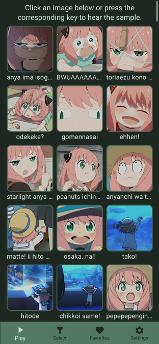
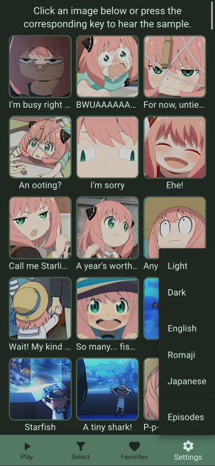
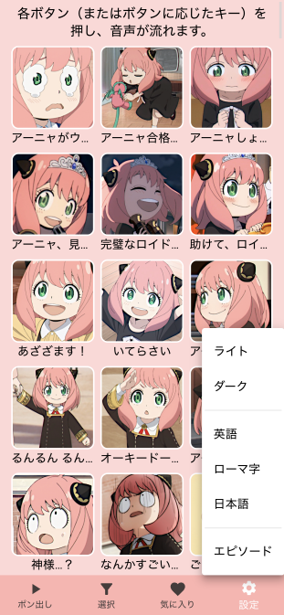
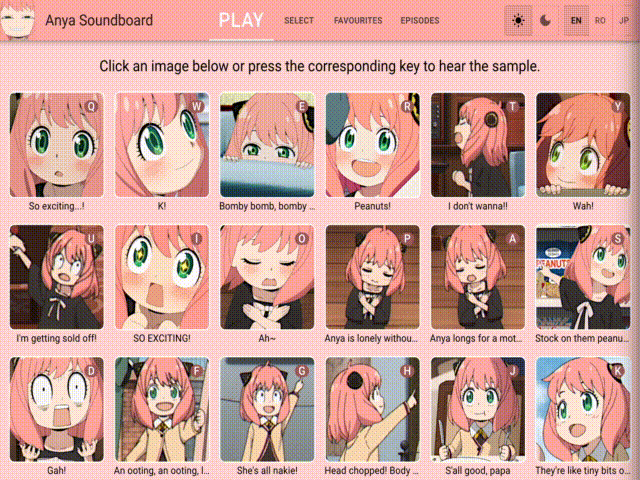

# Anya Soundboard

## About
This is a soundboard of **Anya Forger**'s lines from the anime **Spy x Family**.
There are samples from episodes 1 to 12.
You can choose which episode's samples to display.

Click an image or press the corresponding key to hear the voice sample.

## Features
- Keypress and click functionality
- Ability to select and play favourites
- Episode selector
- Multilanguage
  - English
  - Japanese
  - Romanized Japanese (Romaji)
- Light and dark modes
- Mobile and responsive layouts

# Screenshots
### Light mode

### Dark mode (and Japanese version)

### Mobile version

### Episode selection

### Favourites

## Stack

- [React Transition Group](https://reactcommunity.org/react-transition-group/)

## Versions

**Version 1.0.0**
- Samples from episodes 1 and 2
- Light and dark modes
- Responsive and mobile layouts

**Version 1.1.0**
- Updated mobile view
- Samples from episode 3 to 6 added
- Japanese text added
- Adaptive keypress function to optimize which keys are assigned to samples
- Added episode selector

**Version 1.2.0**
- Samples from episode 7 added
- Updated mobile view with new menu
- Added "favourites" functionality

**Version 1.3.0**
- Updated desktop view
- Fixed theme colours

**Versions 2.0.0**
- Added all episode samples
- Fixed layouts
- Added episode selector to Settings on mobile view