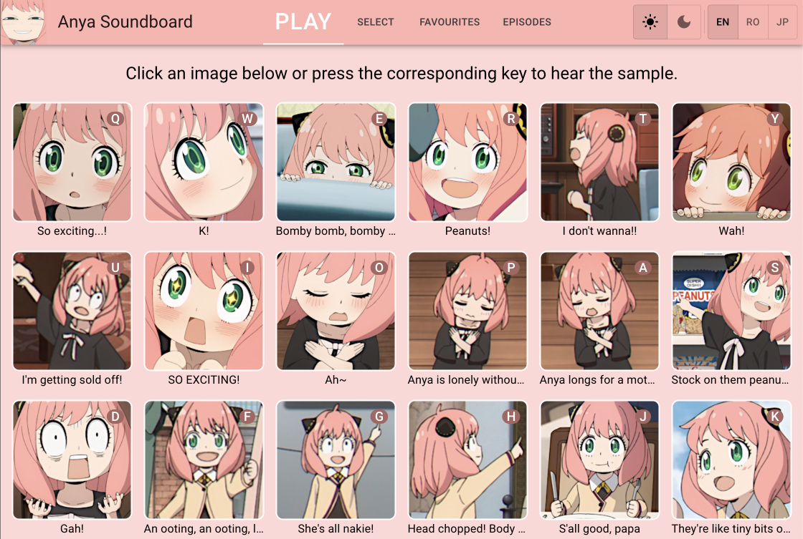
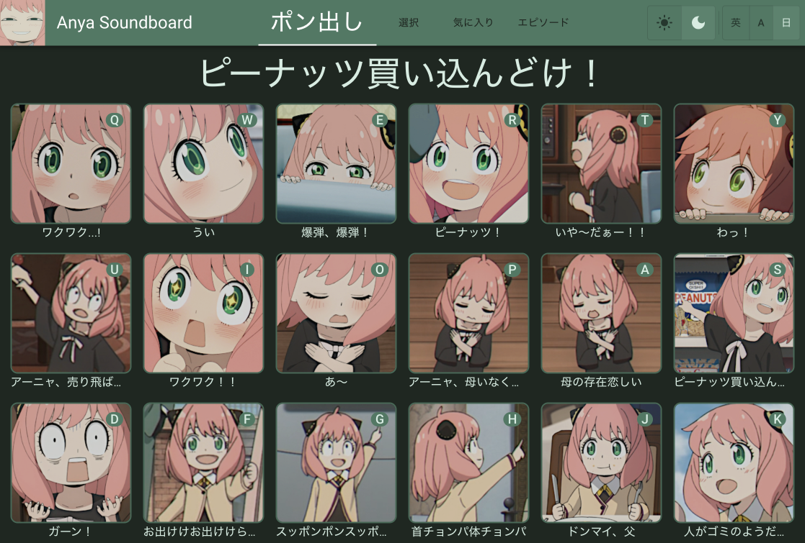

# Anya Soundboard

## About
This is a soundboard of **Anya Forger**'s lines from the anime **Spy x Family**.
Currently, there are samples from episodes 1 to 6.
You can choose which episode's samples to display.

This app also features light and dark modes and a responsive layout.
### Light mode

### Dark mode (and Japanese version)

### Mobile version

### Episode selection

## Stack

- [React Transition Group](https://reactcommunity.org/react-transition-group/)

## Versions

**Version 1.0.0**
- Samples from episodes 1 and 2
- Light and dark modes
- Responsive and mobile layouts

**Version 1.1.0**
- Updated mobile view
- Samples from episode 3 to 6 added
- Japanese text added
- Adaptive keypress function to optimize which keys are assigned to samples
- Added episode selector

**Version 1.2.0**
- Samples from episode 7 added
- Updated mobile view with new menu
- Added "favourites" functionality

## Future Plans
- [x] Choose samples for customized soundboard
- More samples
- Add episode selector to mobile view